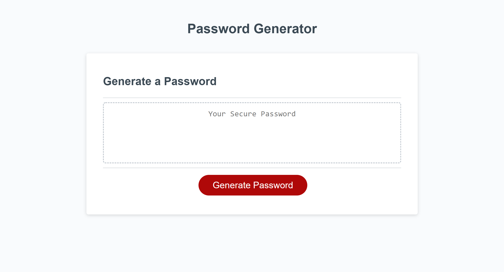

# Password-Generator

## README

## Introduction:
This web application is a fully-functional Password Generator where users will be asked what criteria they want their generated password to have, for example the site will alert the user and ask them if they want their password to contain numbers. After answering all questions concerning criteria, they will be asked how long they want their password to be. After this last prompt, the password will be automatically generated and placed into the designated text box.

## Links:
This website does not contain any external links.

## Web Site:
Check out this Password Generator at:
https://bethanyfulcher.github.io/password-generator-bf/

## Screenshot:
The following images shows the web applications appearance:

